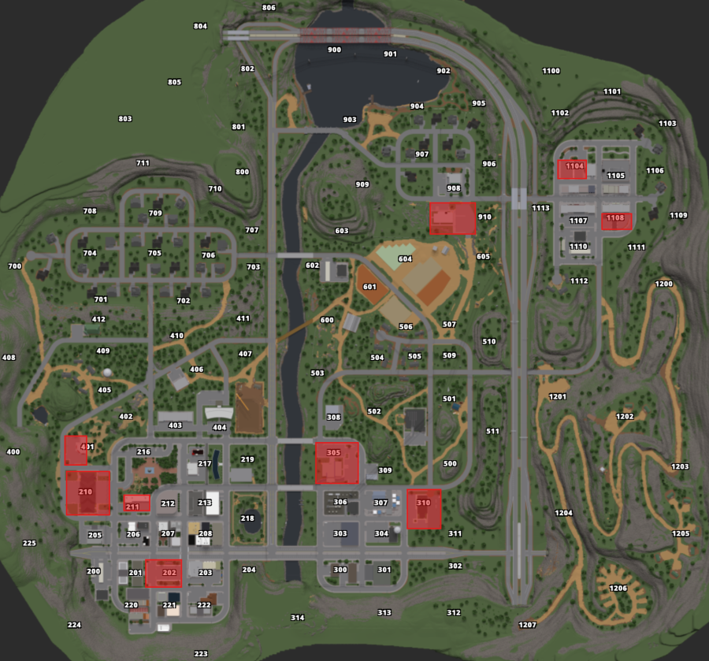

# Safe Zones

Safe Zones are areas of the map where players are not allowed to kill each other, or to inflict any type of damage to each other.

Safe Zones on our server are as follows:

* River City Civilian Spawn
* Springfield Downtown Civilian Spawn
* River City Police Department
* Liberty County Sheriff's Office
* Department of Transportation Building
* River City Vehicle Repair Shop
* Springfield Downtown Vehicle Repair Shop
* River City Gun Store
* Springfield Downtown Gun Store
* River City Fire Department
* Springfield Downtown Fire Department
* River City Courthouse

Or more generally, independent of any changes made to the above locations:

* Any civilian spawn
* Any LEO spawn (DOT, FD, EMS, PD, Sheriff)
* Any gun store
* Any Vehicle Repair Shop

***

On the map:

<figure><figcaption></figcaption></figure>

***

If someone is killed in a safe zone, you can instantly heal them.

If two players kill each other, you may decide to not punish anyone, or punish both.

If a player kills another one and then says "he started" explain that no one should even open fire in a safe zone, nor respond to fire. You can either decide to punish the killer or not.

To clarify, players are not allowed to run into SZs during chases or hunts to avoid being killed.
